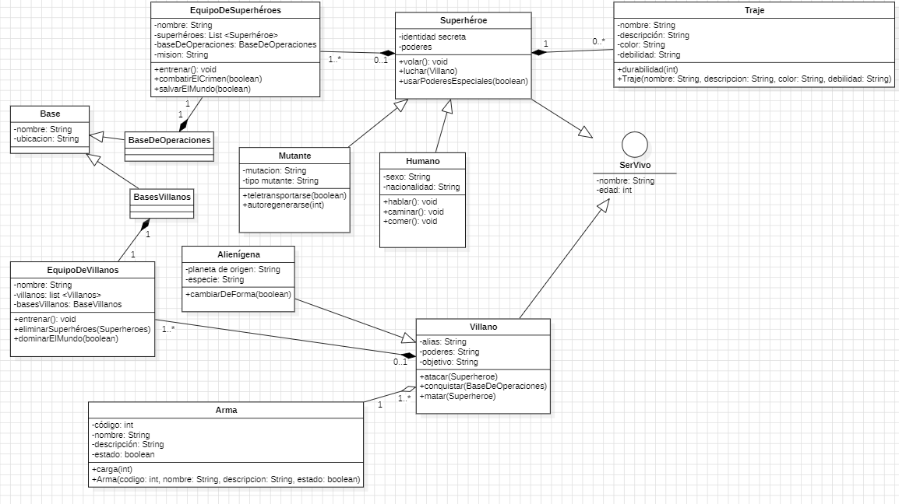

# Universo de Superhéroes y Villanos - Diagrama de Clases

Este proyecto presenta un **diagrama de clases UML** que modela un universo ficticio de superhéroes y villanos, incluyendo sus atributos, métodos, relaciones y multiplicidades.  
El diseño fue realizado en **StarUML** siguiendo los requerimientos dados, y permite representar de forma clara la estructura y conexiones entre los personajes y sus equipos.

## Descripción General

El sistema modela los siguientes elementos principales:

- **Superhéroes**: Pueden ser **Humanos** o **Mutantes**, poseen poderes y pueden usar trajes especiales.
- **Villanos**: Son **Alienígenas** que poseen armas y buscan conquistar el mundo.
- **Equipos**:  
  - *Equipo de Superhéroes*: Agrupa a los héroes y tiene una base de operaciones.  
  - *Equipo de Villanos*: Agrupa a los villanos y tiene sus propias bases.
- **Objetos**:
  - *Traje*: Equipamiento de los superhéroes con ciertas características y debilidades.
  - *Arma*: Herramienta de los villanos para llevar a cabo sus planes.
- **Bases**:
  - *Base de Operaciones*: Lugar donde entrenan y planifican los superhéroes.
  - *Bases Villanos*: Lugares estratégicos donde se reúnen los villanos.

## Diagrama de Clases



## Tecnologías Utilizadas
- **StarUML**: Modelado de clases UML.
- **Markdown**: Documentación del proyecto.
- **GitHub**: Control de versiones y alojamiento.

## Estructura del Proyecto
```
/ProyectoSuperheroes
│── superheroes.png   # Imagen del diagrama de clases
│── README.md         # Documentación del proyecto
└── /uml              # Archivos del diagrama en formato StarUML
```

## Funcionalidades Modeladas
- Entrenar superhéroes y villanos.
- Combatir el crimen o dominar el mundo.
- Uso de trajes y armas.
- Teletransportación, regeneración, cambio de forma y vuelo.
- Ataques y conquistas de bases enemigas.

