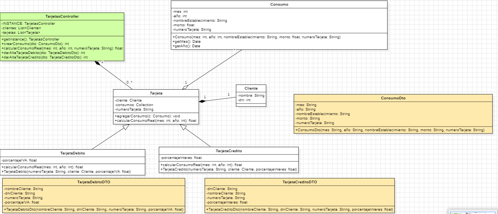

# Sistema de Gestión de Tarjetas de Debito y Credito

Este proyecto es una aplicación de escritorio desarrollada en Java con Swing que permite la gestión de tarjetas de crédito y débito, así como el registro y cálculo de consumos.

## Funcionalidades

- **Alta de Tarjetas de Débito**
- **Alta de Tarjetas de Crédito**
- **Alta de Consumos**
- **Cálculo del Consumo Real** por tarjeta, mes y año

## Estructura del Proyecto

```plaintext
├── src/
│   ├── Controller/
│   │   └── TarjetasController.java
│   ├── dto/
│   │   ├── ConsumoDto.java
│   │   ├── TarjetaCreditoDto.java
│   │   └── TarjetaDebitoDto.java
│   ├── Modelos/
│   │   ├── Cliente.java
│   │   ├── Consumo.java
│   │   ├── Tarjeta.java
│   │   ├── TarjetaCredito.java
│   │   └── TarjetaDebito.java
│   ├── Vista/
│   │   ├── JAltaTarjetaDebito.java
│   │   ├── JAltaTarjetaCredito.java
│   │   ├── JAltaConsumo.java
│   │   ├── JCalcularConsumoReal.java
│   │   └── Main.java
```

### Diagrama de Clases


### Diagrama de Secuencia


## Cómo ejecutar

1. Abrir el proyecto en tu IDE Java (Eclipse, IntelliJ, NetBeans, etc.)
2. Asegurarte de tener configurado el JDK 8 o superior.
3. Ejecutar el archivo `Main.java` ubicado en `Vista`.

## Dependencias

- Java SE 8+
- Swing (incluido en el JDK)

## Ejecución

Al ejecutar la aplicación, se mostrará una ventana con las siguientes opciones:

- **Alta Tarjeta Débito**
- **Alta Tarjeta Crédito**
- **Alta Consumo**
- **Calcular Consumo Real**
- **Salir**

Cada botón abrirá una ventana correspondiente para realizar las operaciones.

## Validaciones

- Todos los campos son obligatorios.
- Se validan tipos numéricos para campos como `Mes`, `Año`, `Monto` y `IVA`.
- Se muestra un mensaje si no se encuentra la tarjeta asociada.

## Ejemplo de Uso

1. Registrar una tarjeta de débito con nombre, DNI, número de tarjeta y porcentaje de IVA.
2. Registrar un consumo ingresando el mes, año, monto, establecimiento y número de tarjeta.
3. Calcular el consumo real ingresando número de tarjeta, mes y año.
